# The bee's are particularly busy this time of year...

The little critters are often too busy to notice the comings and goings of their keepers. Especially when completed at the right time -- before 2nd Breakfast. Well then it's hardly a chore what with them off tending to the blooming mouse-leaf.

# The mild Upper Vales summer has been a boon for hive-health...

_According a dwarf of dubious sobriety, and a scholarly bard otherwise, the Bay of Belfalas is named thus due to winds created by Anduin Valley. When hot air from the east cools over Ered Mithrin it's funnelled back into the valley from the north. Supposedly it's possible to raft all the way to Bay of Belfalas if you know the river hazards. The only trouble is convincing the Elves to give you a lift home after. Though I'd question the authenticity of this map they left me as proof._

___"Aye, it's real. Many a song tells of rafting the Vales. Not as many for Celduin where travelling by pony is faster --there's no wind at your back, you see. In any case I'm interested in new tales to sing --to reinvent myself as a bard of great jewel-smiths. Keep it. I've no further use for rafting. Mayhaps it will bring you good fortune as it did once for me..."___

_It looks more like a scribble on a napkin than a guide to the Great River._

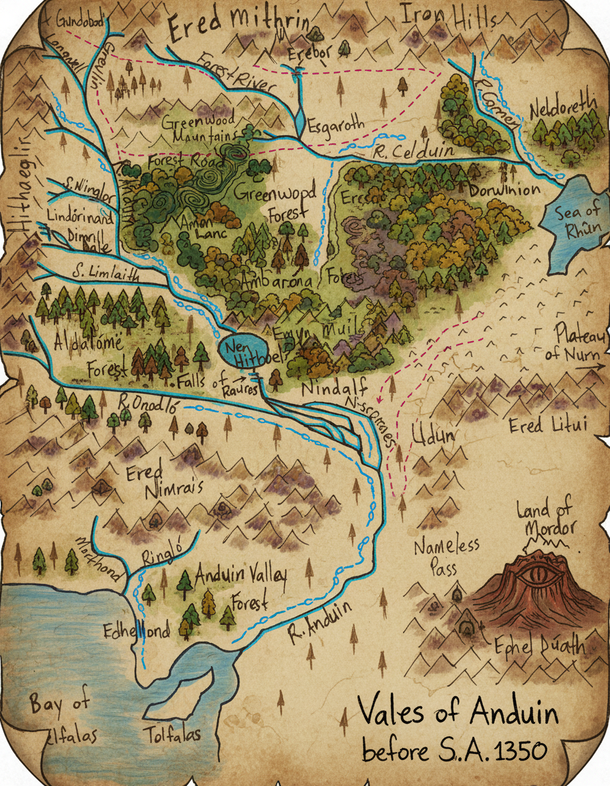

# At this rate the harvest was shaping up to be the bees knees...

The men of Upper Vales would often travel a day's journey, crossing the Great River by way of the North Bridge. All for one of their best delicacies -- Honey Ale. Rumor is the expert Woodsmen are unwilling to use the sturdier Dwarvish Bridge to the South. Something about their crafts being unwelcome in those parts. Why even the nearby Greenwood Elves have been known to drop by on their way to Dimrill Dale. Though the Elves have never been willing to share what they use the honey for. They always look amused and say quite plainly they'll eat it -- several barrel's that is.

_-- Somewhere in the Vale, where the bee's are blissfully unaware of the adventure this day will bring._

# Region: Lindórinand / Homestead

_Facing south towards Middle Vales from NE.Lindórinand. Greenwood Forest on opposite shore. View of Misty Mountains is hidden by tree-line._

_Facing north at NW.Lindórinand near the foothill of Misty Mountains and Nîr Linhaith. A water-spirit of Sîr Ninglor dwells nearby. Seldom seen, except by starlight, when she plays flute melodies seemingly in tune with the Elf-bards of Aldalómë._

_Facing west at NW.Lindórinand near the foothill of Misty Mountains and Nîr Linhaith. The water spirit didn't always have the flute. Upon meeting our kin for the first time she changed into the form of a river otter. The tale goes that the otter fished up an old sword from the base of Nîr Linhaith. Leaving the sword at the foot of one of our kin, she turned to depart. Having nothing else to offer our kin asked them to accept their most prized possession --a flute they use for animal-taming. They've reportedly been the best of friends since._

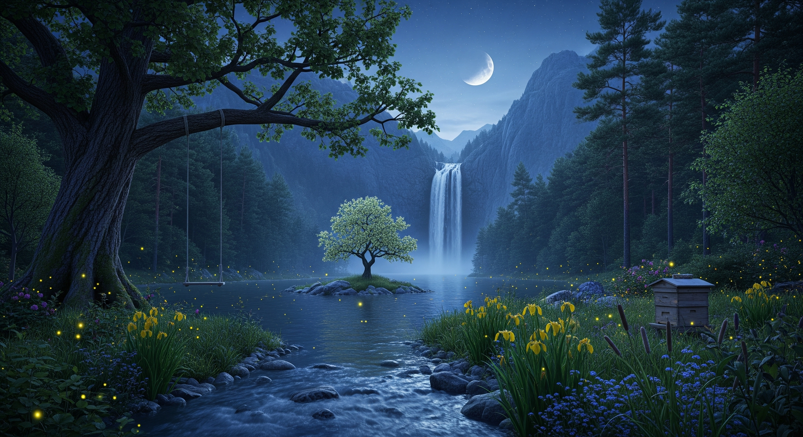

_Facing south at the entrance to Middle Vales from SE.Lindórinand. Greenwood Forest is opposite shore. Here is where Lindórinand becomes Eaves of Fangorn or Aldalómë as it's known by Ents. By starlight you can hear songs of the Elves echoing over the far tree-line. Their minstrels are said to gather for nightly contest along Sîr Limlaith._

_Facing east along Sîr Ninglor towards confluence with the Great River __(with edits)__. Amon Lanc of Greenwood Mountains can be seen in the distance. NE.Lindórinand on the opposite shore. The absence of marshes is a deliberate device in this version of the legendarium._

[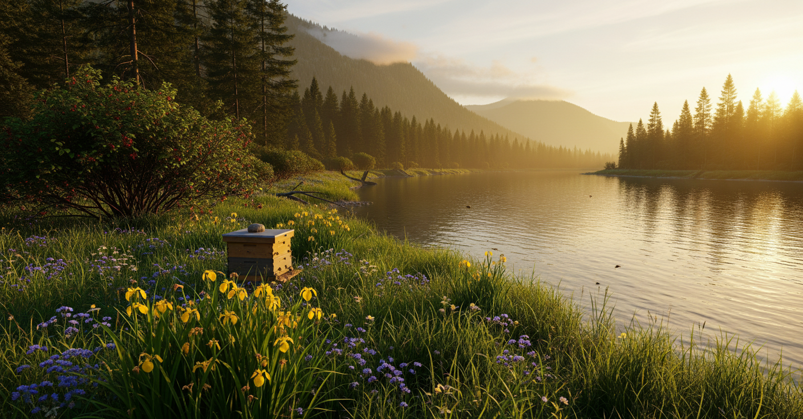](https://raw.githubusercontent.com/lol-dungeonmaster/THaTWoIV-concept-art/main/docs/results/east_1_edit.mp4)

_Facing east along Sîr Ninglor towards confluence with the Great River __(original)__. Amon Lanc of Greenwood Mountains can be seen in the distance. NE.Lindórinand on the opposite shore. The absence of marshes is a deliberate device in this version of the legendarium._

_Facing north along Great River from confluence with Sîr Ninglor. Greenwood Forest and the Forest Road on the opposite shore. The road continues north for another day's journey before turning east. The absence of marshes is a deliberate device in this version of the legendarium._

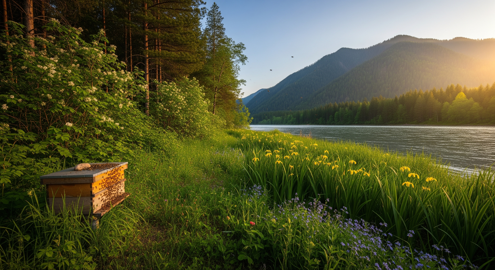

_A bird's eye view of Eagle's Eyrie, near NW.Homestead. West of the Forest Road's entrance. High on a Misty Mountain ledge._

_Ever enimatic, our neighbors, the Great Eagles of Manwë. Always an ally to Vales-folk and watchful over Cirith en Andrath, Pass of the Long Road. That's what the elves call a nearby high-pass over the mountain. The pass connects to the Great Road, travelling west to Lindon. Crafted by the Dwarves of Ered Luin for trade with their Dwarf-kin in Khazad-dûm. It once connected to great elf-kingdoms beyond Lindon before they were ruined. In those days the Dwarves of Khazad-dûm turned their eyes to thier own settlements in the Vales, forsaking their western kin. The road was thus left incomplete, never connecting to the Forest Road due east. These days the pass is used by elf-scouts and dwarf-refugees from the fallen western kingdoms. From high above the pass the eagles scout beyond the foothills of Misty Mountains on both sides. Their keen eyes searching for orcs that raid the northern reaches, or those that may approach from the east. The elves of Lindon and Lindórinand are always eager to learn what they've seen._

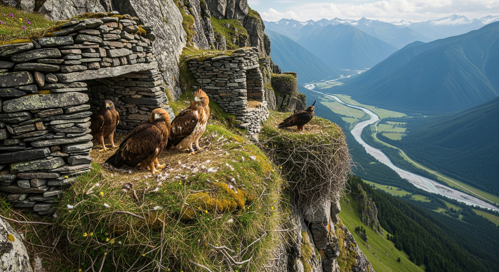

# Region: Cirith Forn

# Region: Forest Road

_If you use a horse, goat or boar and travel light you can complete the journey in half the time. Which raises a fine point, the dwarves really are marvelous in their road building. Their roads connect the upper reaches of the Vales and beyond to Dimrill Dale. Why there's hardly any hoof-wear or mount fatigue reaching the entrance to the road east from Ninglor Crossing. From here the path splits. The high road leads into the valley and Forest Road. It's another day's journey north on the river-bound road, by pony-reckoning, to Greylin Crossing._

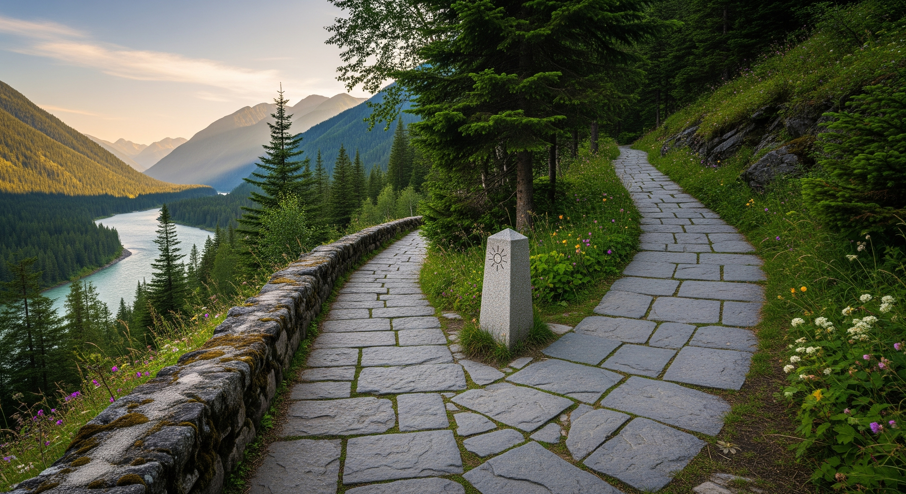

_Two days east by pony, provided you don't get eaten by wild animals, you'll reach Celduin Crossing. This is where the Forest Road exits the Greenwood south of Esgaroth. The bridge is south of Esgaroth-falls where waters from the Forest River and Erebor flow from the long lake. Once, these were lands of the Ents. The Eaves of Neldoreth was where Greenwood Forest met the great beech grove. It grew from across the bridge, to the east, past River Carnen. That was before a shadow fell on the east and the world was changed. Now the Ents lament departing those lands, preferring to tend the land south of the bridge._

___"A shadow-lingers-where-green-should-grow that the one‑who‑makes‑the‑green‑things‑grow cannot cleanse..."___ _, is their rather cryptic Entish explanation._

_Few, except the Dwarves, use the bridge nowadays. The path leads north along the west side of Esgaroth to their outpost, Erebor. Across the bridge leads north-east to their outpost in Iron Hills. Elves will sometimes traverse the Forest Road then follow the river south-east to Dorwinion. Not to taste the artisan wines, they'll say, so much as the pilgrimage to visit relatives. East-folk from Rhûn occasionally follow River Celduin or Carnen upstream. Those few that reach the Vales are oft-greeted with suspicion by wary Upper Vales-folk._

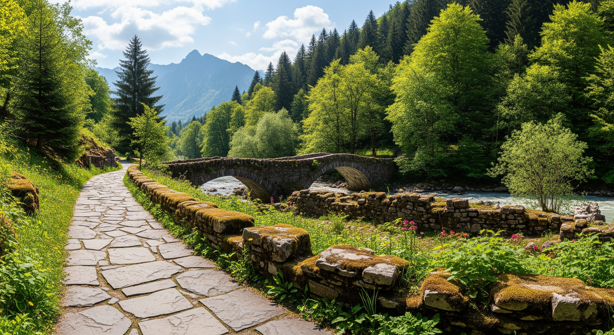

# Region: Dorwinion

_South-west of where River Celduin empties into the Sea of Rhûn in East Dorwinion. Facing north-east. The Port of Dorwinion and it's neighboring vineyards. The River Celduin meets a hilly plateau on it's south shore after confluence with River Carnen. The hills extend south until reaching the woods of Ambaróna. A reclusive wine-producing guild has built extensive vineyards in the area._

_It's a curious place, Dorwinion. The only roads into the port barely count as trails. You'll know you're in the area when the forest becomes hilly valleys and vineyards. Buildings along the hillsides use clay for insulation. It gives them a distinctive golden hue in sunlight. Only here will you meet men, elves and dwarves speaking Sindarin. Tales of the region say it was founded by artisans of Rhûn near the start of the Goblin-Wars. The subjugation of Nurn created divided loyalties in Rhûn, causing some to depart rather than choose. In the isolated valley's of Dorwinion is where they started anew. They eventually impressed the lingering elves with their crafts. The elves taught them their language and named them Dorwinion, the Land of Wines. It's said even Durin II knew of the valley after receiving a cask as a gift from the elves. So enamored was Durin, and without a way to make it himself in the mountain halls, that he had no recourse. He sent his best artisans to Dorwinion to carve deep cellars beneath the hillsides. Production has increased substantially in the years since._

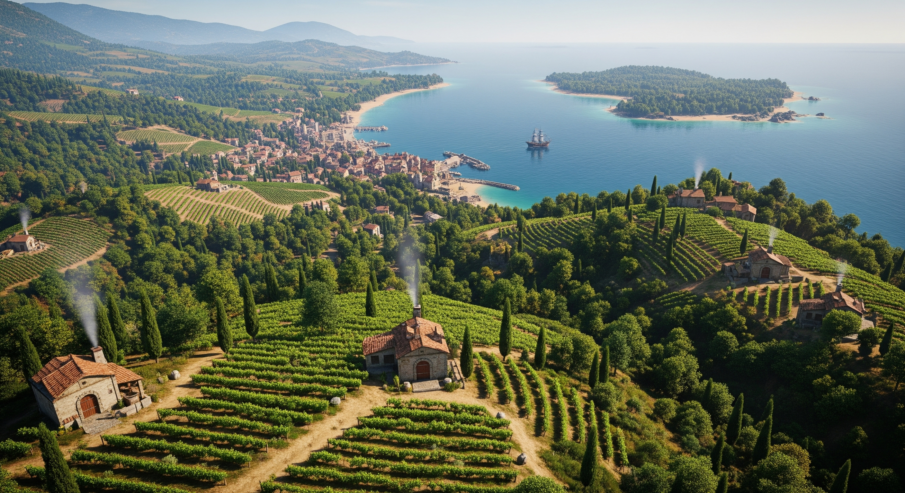

# Region: Dimrill Dale

_A bird's eye view of the East-gate into Khazad-dûm in Dimrill Dale. The elves call this place Nanduhirion for the lake, which is said to dim even the light of midday. The Looking-glass Lake, or Mirrormere where you can see your future in the stars of brightest daylight. Or, so the dwarves speak of in tales. Next to the waterfall a mountain pass heads west. Fortunately this is midsummer. In the winter the foot of the mountain pass requires constant snow-removal. Futher east the Mirrormere empties into Sîr Celebrant before confluence with the Great River._

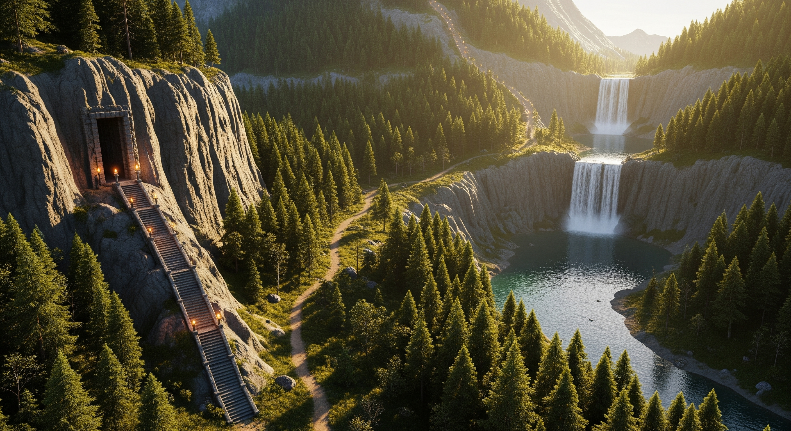

_Those adventurous enough to climb the mountain pass better come prepared. At the top of Dimrill Stair you must pass through the East Redhorn Gate. Which, from the east side is a portcullis and a tunnel with traps. Then you must journey west across dangerous drops and ravines. Watchtowers line the pass west ready to signal an enemy's approach._

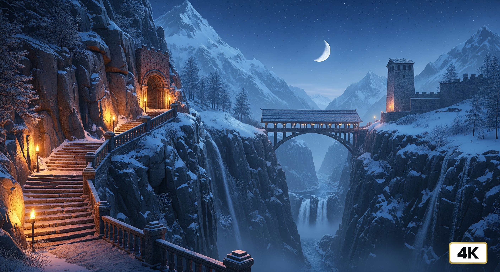

_I once snuck a peek into the Mirrormere while on consignment for the Ents. "A crown that speaks of good fortune", as the dwarves would boast. I'm not sure I would say I saw a crown. Maybe they meant a crown of stars? After all, this season's honey harvest does look certain to be best ever._

# Region: Nindalf

_Facing east at the foothill of Emyn Muil where it meets NW.Mordor. On the left is the south edge of Emyn Muil. On the right is the north edge of Mordor. A smoky, sulphurous haze drifts from the sleeping Mt.Doom most hours of the day. The great flood-plains of Nindalf are behind the camera view._ 

_As if Entish were tricky enough, try asking the Knights of Númenor why they enperil themselves with scouting the uncharted ways south of Khazad-dûm. They arrive wearing only rugged ranger gear, but who else could they be? Scouts at Khazad-dûm say they never return. Rumor is there's a guarded pass in Ephel Dúath to the south. Clearly the Númenóreans are scouting the Nindalf for what an Ent would call, the-usurper. Then they raft their way down the river to the outpost of Tolfalas, never to return. Why they pratically send a new scout, sometimes two, every moon-cycle._

_The Entish legend of the lost grove of Neldoreth begins here in the valley between Emyn Muil and Mordor. It was here the enemy they call, the-shadow, began his campaign in the east. Morgoth, the elves speak of, enjoyed building fortresses and pits of evil in first-age Arda. It was during the Goblin-Wars he returned to build one such fortress in Mordor. Subjugating the settlers of Nurn in the process. As Morgoth's strength against the Valar waned later in first-age, he again returned to Mordor. This time subjugating the east with a great legion of orcs, balrogs and a dragon. They sowed evil-seeds with the intent to disrupt an alliance with the elves. Thus, the great grove came to be poisoned by what the Ents call, a-shadow-lingering, that fell on the east._

_It's sometimes said the Nindalf is haunted by spirits still bound to their oaths to defend the pass. Fireflies keep the willows company in the marshes where a lush forest supposedly once existed long ago._

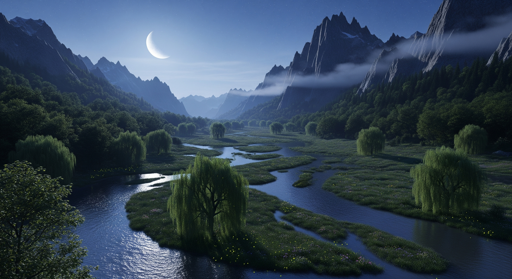

# Region: Anduin Valley

_Facing south-west at E.Tolfalas in the Bay of Belfalas. The Great River and Anduin Valley are behind the camera view._

_First established as a minor fort, the island of Tolfalas has thrived as a second home for the elite and adventurous among the Númenóreans. Now it's a merchant haven with new inhabitants arriving each week. Mainly a mix of kin to military, merchants and influential. Most arrive eager to make trophies of the beasts of Harad. Others look to the vast open hills of Anduin Valley as remarkably unstifling compared to Númenór. The ones that stay usually cater to the adventurous or exchange of trade goods._

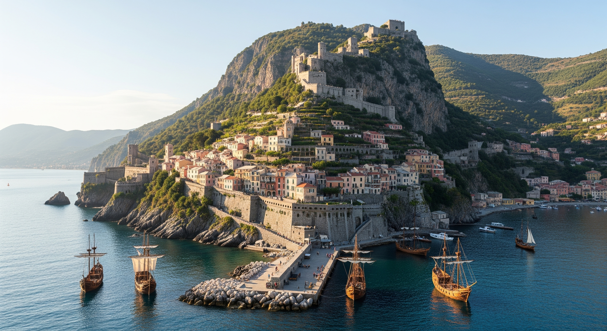

_Facing north-east at W.Tolfalas in the Bay of Belfalas. The Great Sea of Belegaer is behind the camera view._

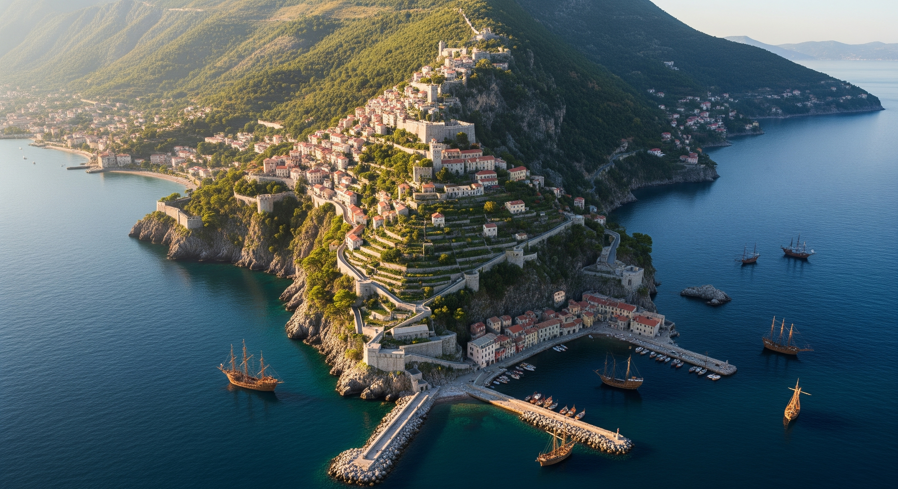
