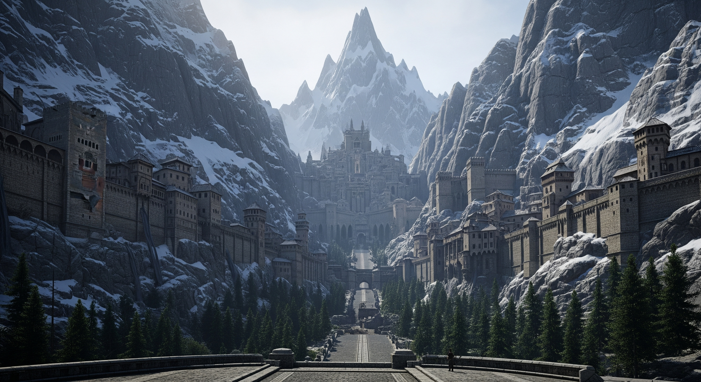
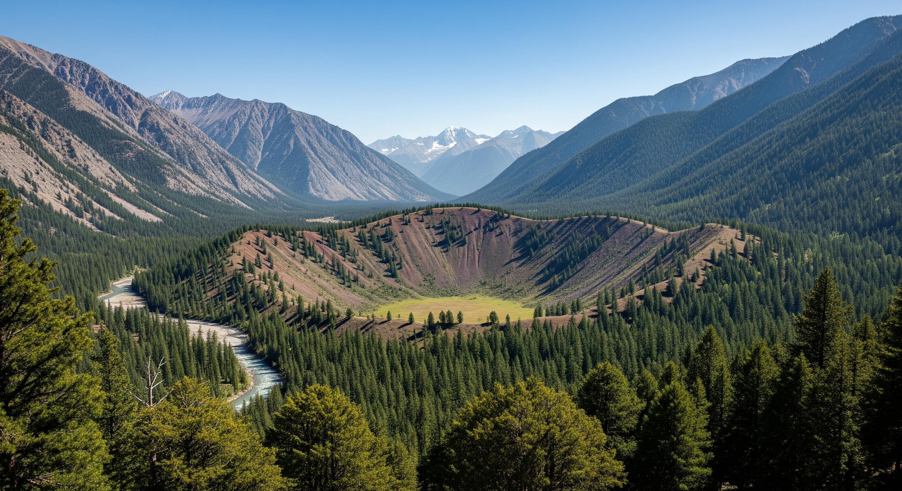
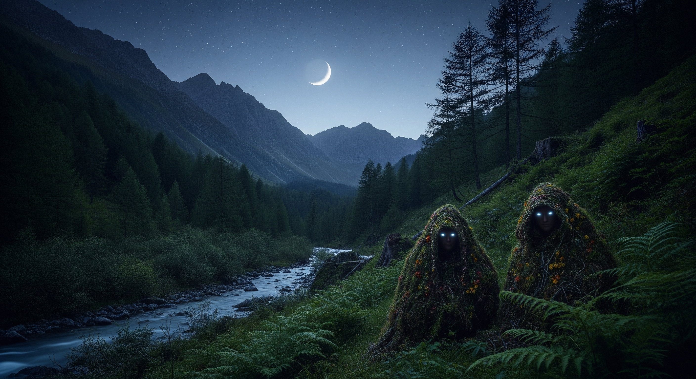
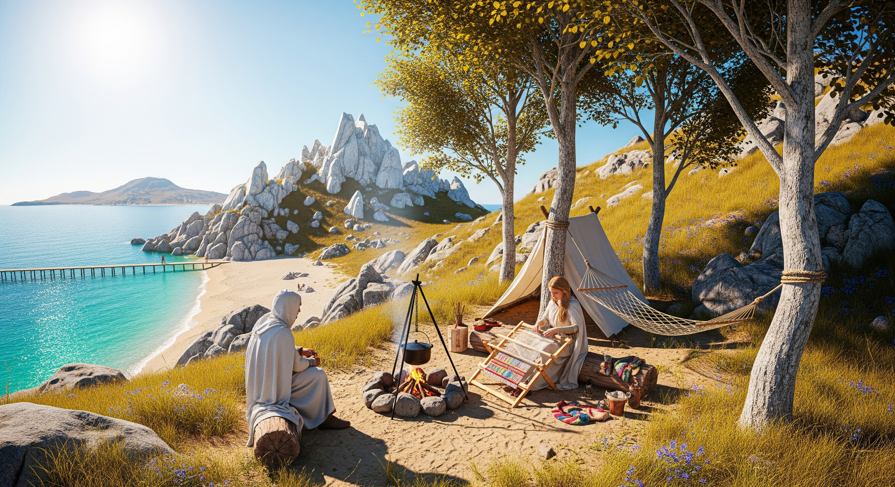

<script defer>
    document.addEventListener("DOMContentLoaded", () => {
        document.querySelectorAll(".collapsible-code").forEach(container => {
            const button = container.querySelector("button");
            const pre    = container.querySelector("pre");

            pre.style.display = "none";

            button.addEventListener("click", () => {
                const isOpen = pre.style.display === "block";
                pre.style.display = isOpen ? "none" : "block";
                button.classList.toggle("expanded", !isOpen);
            });
        });
    });
</script>

<div class="collapsible-code">
<button type="button">Setup the environment</button>
<div class="language-python highlighter-rouge"><pre class="highlight"><code><span class="c1"># Setup the environment
</span>
<span class="o">%</span><span class="n">pip</span> <span class="n">install</span> <span class="o">-</span><span class="n">qU</span> <span class="n">google</span><span class="o">-</span><span class="n">genai</span><span class="o">==</span><span class="mf">1.29</span><span class="p">.</span><span class="mi">0</span> <span class="n">google</span><span class="o">-</span><span class="n">api</span><span class="o">-</span><span class="n">core</span> <span class="n">lmnr</span><span class="p">[</span><span class="nb">all</span><span class="p">]</span> <span class="n">Pillow</span>

<span class="kn">import</span> <span class="n">os</span><span class="p">,</span> <span class="n">io</span><span class="p">,</span> <span class="n">IPython</span><span class="p">,</span> <span class="n">time</span>
<span class="kn">from</span> <span class="n">google</span> <span class="kn">import</span> <span class="n">genai</span>
<span class="kn">from</span> <span class="n">google.api_core</span> <span class="kn">import</span> <span class="n">retry</span><span class="p">,</span> <span class="n">exceptions</span>
<span class="kn">from</span> <span class="n">google.genai</span> <span class="kn">import</span> <span class="n">types</span>
<span class="kn">from</span> <span class="n">io</span> <span class="kn">import</span> <span class="n">BytesIO</span>
<span class="kn">from</span> <span class="n">lmnr</span> <span class="kn">import</span> <span class="n">Laminar</span>
<span class="kn">from</span> <span class="n">PIL</span> <span class="kn">import</span> <span class="n">Image</span>

<span class="k">class</span> <span class="nc">UserSecretsClient</span><span class="p">:</span>
    <span class="nd">@classmethod</span>
    <span class="k">def</span> <span class="nf">get_secret</span><span class="p">(</span><span class="n">cls</span><span class="p">,</span> <span class="nb">id</span><span class="p">:</span> <span class="nb">str</span><span class="p">):</span>
        <span class="k">try</span><span class="p">:</span>
            <span class="k">return</span> <span class="n">os</span><span class="p">.</span><span class="n">environ</span><span class="p">[</span><span class="nb">id</span><span class="p">]</span>
        <span class="k">except</span> <span class="nb">KeyError</span> <span class="k">as</span> <span class="n">e</span><span class="p">:</span>
            <span class="nf">print</span><span class="p">(</span><span class="sa">f</span><span class="sh">"</span><span class="s">KeyError: authentication token for </span><span class="si">{</span><span class="nb">id</span><span class="si">}</span><span class="s"> is undefined</span><span class="sh">"</span><span class="p">)</span>

<span class="n">GOOGLE_API_KEY</span> <span class="o">=</span> <span class="nc">UserSecretsClient</span><span class="p">().</span><span class="nf">get_secret</span><span class="p">(</span><span class="sh">"</span><span class="s">GOOGLE_API_KEY</span><span class="sh">"</span><span class="p">)</span>

<span class="k">try</span><span class="p">:</span>
    <span class="n">Laminar</span><span class="p">.</span><span class="nf">initialize</span><span class="p">(</span><span class="n">project_api_key</span><span class="o">=</span><span class="nc">UserSecretsClient</span><span class="p">().</span><span class="nf">get_secret</span><span class="p">(</span><span class="sh">"</span><span class="s">LMNR_PROJECT_API_KEY</span><span class="sh">"</span><span class="p">))</span>
<span class="k">except</span><span class="p">:</span>
    <span class="nf">print</span><span class="p">(</span><span class="sh">"</span><span class="s">Skipping Laminar.initialize()</span><span class="sh">"</span><span class="p">)</span>

<span class="n">client</span> <span class="o">=</span> <span class="n">genai</span><span class="p">.</span><span class="nc">Client</span><span class="p">(</span><span class="n">api_key</span><span class="o">=</span><span class="n">GOOGLE_API_KEY</span><span class="p">)</span>

<span class="n">is_retriable</span> <span class="o">=</span> <span class="k">lambda</span> <span class="n">e</span><span class="p">:</span> <span class="p">(</span><span class="nf">isinstance</span><span class="p">(</span><span class="n">e</span><span class="p">,</span> <span class="n">genai</span><span class="p">.</span><span class="n">errors</span><span class="p">.</span><span class="n">APIError</span><span class="p">)</span> <span class="ow">and</span> <span class="n">e</span><span class="p">.</span><span class="n">code</span> <span class="ow">in</span> <span class="p">{</span><span class="mi">429</span><span class="p">,</span> <span class="mi">503</span><span class="p">,</span> <span class="mi">500</span><span class="p">})</span>
<span class="n">genai</span><span class="p">.</span><span class="n">models</span><span class="p">.</span><span class="n">Models</span><span class="p">.</span><span class="n">generate_images</span> <span class="o">=</span> <span class="n">retry</span><span class="p">.</span><span class="nc">Retry</span><span class="p">(</span>
    <span class="n">predicate</span><span class="o">=</span><span class="n">is_retriable</span><span class="p">)(</span><span class="n">genai</span><span class="p">.</span><span class="n">models</span><span class="p">.</span><span class="n">Models</span><span class="p">.</span><span class="n">generate_images</span><span class="p">)</span>
<span class="n">genai</span><span class="p">.</span><span class="n">models</span><span class="p">.</span><span class="n">Models</span><span class="p">.</span><span class="n">generate_videos</span> <span class="o">=</span> <span class="n">retry</span><span class="p">.</span><span class="nc">Retry</span><span class="p">(</span>
    <span class="n">predicate</span><span class="o">=</span><span class="n">is_retriable</span><span class="p">)(</span><span class="n">genai</span><span class="p">.</span><span class="n">models</span><span class="p">.</span><span class="n">Models</span><span class="p">.</span><span class="n">generate_videos</span><span class="p">)</span>
<span class="n">genai</span><span class="p">.</span><span class="n">models</span><span class="p">.</span><span class="n">Models</span><span class="p">.</span><span class="n">generate_content</span> <span class="o">=</span> <span class="n">retry</span><span class="p">.</span><span class="nc">Retry</span><span class="p">(</span>
    <span class="n">predicate</span><span class="o">=</span><span class="n">is_retriable</span><span class="p">)(</span><span class="n">genai</span><span class="p">.</span><span class="n">models</span><span class="p">.</span><span class="n">Models</span><span class="p">.</span><span class="n">generate_content</span><span class="p">)</span>
</code></pre></div>
</div>

# The bee's are particularly busy this time of year...

The little critters are often too busy to notice the comings and goings of their keepers. Especially when completed at the right time -- before 2nd Breakfast. Well then it's hardly a chore what with them off tending to the blooming mouse-leaf.

<div class="collapsible-code">
<button type="button">Generate base images</button>
<div class="language-python highlighter-rouge"><pre class="highlight"><code><span class="c1"># Generate base images
</span>
<span class="n">prompt</span> <span class="o">=</span> <span class="sh">"""</span><span class="s">A 4K studio photo of a forest clearing next to a great river in mid-summer. 
Use a wide-angle lens, golden hour lighting, and 16:9 aspect. 
The river is a vast tributary of large width. 
The forest is a mixture of fir and pine. 
The undergrowth is thick with flowering wild berries and old growth. 
Next to the river</span><span class="sh">'</span><span class="s">s edge patches of yellow Iris and blue Myosotis grow along with reeds. 
A rustic beehive can be seen in the forest clearing near the water</span><span class="sh">'</span><span class="s">s edge. 
It</span><span class="sh">'</span><span class="s">s bee</span><span class="sh">'</span><span class="s">s are eagerly feeding on the nearby wildflowers. 
On the other side a mountain range rises in the distance.
Face the camera across the river width.
With the sun on the right side.</span><span class="sh">"""</span>

<span class="n">standard</span> <span class="o">=</span> <span class="sh">"</span><span class="s">imagen-4.0-generate-001</span><span class="sh">"</span>
<span class="n">ultra</span> <span class="o">=</span> <span class="sh">"</span><span class="s">imagen-4.0-ultra-generate-001</span><span class="sh">"</span>

<span class="k">def</span> <span class="nf">generate_image</span><span class="p">(</span><span class="n">prompt</span><span class="p">):</span>
  <span class="n">result</span> <span class="o">=</span> <span class="n">client</span><span class="p">.</span><span class="n">models</span><span class="p">.</span><span class="nf">generate_images</span><span class="p">(</span>
      <span class="n">model</span><span class="o">=</span><span class="n">ultra</span><span class="p">,</span>
      <span class="n">prompt</span><span class="o">=</span><span class="n">prompt</span><span class="p">,</span>
      <span class="n">config</span><span class="o">=</span><span class="nf">dict</span><span class="p">(</span><span class="n">aspect_ratio</span><span class="o">=</span><span class="sh">"</span><span class="s">16:9</span><span class="sh">"</span><span class="p">,</span> <span class="n">image_size</span><span class="o">=</span><span class="sh">"</span><span class="s">2k</span><span class="sh">"</span><span class="p">)</span> <span class="c1"># person_generation="DONT_ALLOW"
</span>  <span class="p">)</span>
  <span class="k">for</span> <span class="n">n</span><span class="p">,</span> <span class="n">generated_image</span> <span class="ow">in</span> <span class="nf">enumerate</span><span class="p">(</span><span class="n">result</span><span class="p">.</span><span class="n">generated_images</span><span class="p">):</span>
    <span class="p">(</span><span class="n">image</span> <span class="p">:</span><span class="o">=</span> <span class="n">generated_image</span><span class="p">.</span><span class="n">image</span><span class="p">).</span><span class="nf">save</span><span class="p">(</span><span class="sa">f</span><span class="sh">"</span><span class="s">docs/results/scene_</span><span class="si">{</span><span class="n">n</span><span class="si">}</span><span class="s">.jpg</span><span class="sh">"</span><span class="p">)</span>
    <span class="p">(</span><span class="n">image</span> <span class="p">:</span><span class="o">=</span> <span class="n">generated_image</span><span class="p">.</span><span class="n">image</span><span class="p">).</span><span class="nf">show</span><span class="p">()</span>

<span class="nf">generate_image</span><span class="p">(</span><span class="n">prompt</span><span class="p">)</span>
</code></pre></div>
</div>

# The mild Upper Vales summer has been a boon for hive-health...

<div class="collapsible-code">
<button type="button">Generate a map of the region</button>
<div class="language-python highlighter-rouge"><pre class="highlight"><code><span class="c1"># Generate a map of the region
</span>
<span class="n">map_src</span> <span class="o">=</span> <span class="n">Image</span><span class="p">.</span><span class="nf">open</span><span class="p">(</span><span class="sh">"</span><span class="s">docs/src/vales_of_anduin_sketch.jpg</span><span class="sh">"</span><span class="p">)</span>

<span class="n">prompt</span> <span class="o">=</span> <span class="sh">"""</span><span class="s">I need pictographs to restore an old map.
Provide pictograph pieces to assemble a mountain-range in watercolored black-walnut.
None of the pieces have snow capped peaks, all are bare rocky peaks.
Provide the pictographs in old-cartography style at HD-scale mipmap.
Limit yourself to 1-style displayed at a time. Fill the sheet with individual mountains of the style.
Provide only the result on a transparent/clear background without border or embellishment.
Do not include compass or distance indicators.
Draw all options on a single sheet.</span><span class="sh">"""</span>

<span class="n">result</span> <span class="o">=</span> <span class="n">client</span><span class="p">.</span><span class="n">models</span><span class="p">.</span><span class="nf">generate_content</span><span class="p">(</span>
    <span class="n">model</span><span class="o">=</span><span class="sh">"</span><span class="s">gemini-2.5-flash-image-preview</span><span class="sh">"</span><span class="p">,</span>
    <span class="n">contents</span><span class="o">=</span><span class="n">prompt</span>
<span class="p">)</span>

<span class="k">for</span> <span class="n">part</span> <span class="ow">in</span> <span class="n">result</span><span class="p">.</span><span class="n">candidates</span><span class="p">[</span><span class="mi">0</span><span class="p">].</span><span class="n">content</span><span class="p">.</span><span class="n">parts</span><span class="p">:</span>
    <span class="k">if</span> <span class="n">part</span><span class="p">.</span><span class="n">text</span><span class="p">:</span>
        <span class="nf">print</span><span class="p">(</span><span class="n">part</span><span class="p">.</span><span class="n">text</span><span class="p">)</span>
    <span class="k">elif</span> <span class="n">part</span><span class="p">.</span><span class="n">inline_data</span> <span class="ow">is</span> <span class="ow">not</span> <span class="bp">None</span><span class="p">:</span>
        <span class="n">image</span> <span class="o">=</span> <span class="n">Image</span><span class="p">.</span><span class="nf">open</span><span class="p">(</span><span class="nc">BytesIO</span><span class="p">(</span><span class="n">part</span><span class="p">.</span><span class="n">inline_data</span><span class="p">.</span><span class="n">data</span><span class="p">))</span>
        <span class="n">image</span><span class="p">.</span><span class="nf">save</span><span class="p">(</span><span class="sh">"</span><span class="s">docs/results/greenwood_mtn.png</span><span class="sh">"</span><span class="p">)</span>

<span class="n">Image</span><span class="p">.</span><span class="nf">open</span><span class="p">(</span><span class="sh">"</span><span class="s">docs/results/greenwood_mtn.png</span><span class="sh">"</span><span class="p">)</span>
</code></pre></div>
</div>

According a dwarf of dubious sobriety, and a scholarly bard otherwise, the Bay of Belfalas is named thus due to winds created by Anduin Valley. When hot air from the east cools over Ered Mithrin it's funnelled back into the valley from the north. Supposedly it's possible to raft all the way to Bay of Belfalas if you know the river hazards. The only trouble is convincing the Elves to give you a lift home after. Though I'd question the authenticity of this map they left me as proof.

___"Aye, it's real. Many a song tells of rafting the Vales. Not as many for Celduin where travelling by pony is faster --there's no wind at your back, you see. In any case I'm interested in new tales to sing --to reinvent myself as a bard of great jewel-smiths. Keep it. I've no further use for rafting. Mayhaps it will bring you good fortune as it did once for me..."___

It looks more like a scribble on a napkin than a guide to the Great River.


# At this rate the harvest was shaping up to be the bees knees...

The men of Upper Vales will often travel a day's journey, crossing the Great River by way of the North Bridge. All for one of their best delicacies -- Honey Ale. Rumor is the expert Woodsmen are unwilling to use the sturdier Dwarvish Bridge to the South. Something about their crafts being unwelcome in those parts. Why even the nearby Greenwood Elves have been known to drop by on their way to Dimrill Dale. Though the Elves have never been willing to share what they use the honey for. They always look amused and say quite plainly they'll eat it -- several barrel's that is.

_-- Somewhere in the Vale, where the bee's are blissfully unaware of the adventure this day will bring._

<div class="collapsible-code">
<button type="button">Generate from base images</button>
<div class="language-python highlighter-rouge"><pre class="highlight"><code><span class="c1"># Generate from base images
</span>
<span class="k">def</span> <span class="nf">generate_video</span><span class="p">(</span><span class="n">image</span><span class="p">,</span> <span class="n">prompt</span><span class="p">):</span>
    <span class="c1"># Converting the image to bytes
</span>    <span class="n">image_bytes_io</span> <span class="o">=</span> <span class="n">io</span><span class="p">.</span><span class="nc">BytesIO</span><span class="p">()</span>
    <span class="n">image</span><span class="p">.</span><span class="nf">save</span><span class="p">(</span><span class="n">image_bytes_io</span><span class="p">,</span> <span class="nb">format</span><span class="o">=</span><span class="n">image</span><span class="p">.</span><span class="nb">format</span><span class="p">)</span>
    <span class="n">image_bytes</span> <span class="o">=</span> <span class="n">image_bytes_io</span><span class="p">.</span><span class="nf">getvalue</span><span class="p">()</span>

    <span class="n">operation</span> <span class="o">=</span> <span class="n">client</span><span class="p">.</span><span class="n">models</span><span class="p">.</span><span class="nf">generate_videos</span><span class="p">(</span>
        <span class="n">model</span><span class="o">=</span><span class="sh">"</span><span class="s">veo-3.0-generate-001</span><span class="sh">"</span><span class="p">,</span> <span class="c1"># veo-3.0-generate-001, veo-3.0-fast-generate-001
</span>        <span class="n">prompt</span><span class="o">=</span><span class="n">prompt</span><span class="p">,</span>
        <span class="n">image</span><span class="o">=</span><span class="n">types</span><span class="p">.</span><span class="nc">Image</span><span class="p">(</span><span class="n">image_bytes</span><span class="o">=</span><span class="n">image_bytes</span><span class="p">,</span> <span class="n">mime_type</span><span class="o">=</span><span class="n">image</span><span class="p">.</span><span class="nb">format</span><span class="p">),</span>
        <span class="n">config</span><span class="o">=</span><span class="n">types</span><span class="p">.</span><span class="nc">GenerateVideosConfig</span><span class="p">(</span>
            <span class="n">aspect_ratio</span><span class="o">=</span><span class="sh">"</span><span class="s">16:9</span><span class="sh">"</span><span class="p">,</span>
            <span class="n">number_of_videos</span><span class="o">=</span><span class="mi">1</span><span class="p">))</span>
    
    <span class="k">while</span> <span class="ow">not</span> <span class="n">operation</span><span class="p">.</span><span class="n">done</span><span class="p">:</span>
        <span class="nf">print</span><span class="p">(</span><span class="sh">"</span><span class="s">Waiting for video generation to complete...</span><span class="sh">"</span><span class="p">)</span>
        <span class="n">time</span><span class="p">.</span><span class="nf">sleep</span><span class="p">(</span><span class="mi">10</span><span class="p">)</span>
        <span class="n">operation</span> <span class="o">=</span> <span class="n">client</span><span class="p">.</span><span class="n">operations</span><span class="p">.</span><span class="nf">get</span><span class="p">(</span><span class="n">operation</span><span class="p">)</span>

    <span class="k">return</span> <span class="n">operation</span><span class="p">.</span><span class="n">result</span><span class="p">.</span><span class="n">generated_videos</span><span class="p">[</span><span class="mi">0</span><span class="p">]</span>
</code></pre></div>
</div>

# Region: Lindórinand / Homestead

```python
south_1 = Image.open("docs/standard/scene_1.jpg")
```

_Facing south towards Middle Vales from NE.Lindórinand. Greenwood Forest on opposite shore. View of Hithaeglir is hidden by tree-line._

[](results/south_1.mp4)

```python
north_1 = Image.open("docs/standard/scene_2.jpg")
```

_Facing north at NW.Lindórinand near the foothills of Hithaeglir and Nîr Linhaith._ A water-spirit of Sîr Ninglor dwells nearby. Seldom seen, except by starlight, when she plays flute melodies seemingly in tune with the Elf-bards of Aldalómë.


<div class="collapsible-code">
<button type="button">Generate a view of Nîr Linhaith</button>
<div class="language-python highlighter-rouge"><pre class="highlight"><code><span class="c1"># Generate a view of Nîr Linhaith
</span>
<span class="n">prompt</span> <span class="o">=</span> <span class="sh">"""</span><span class="s">A 4K studio quality photo-realistic scene. Use a wide-angle lens, and 16:9 aspect. It</span><span class="sh">'</span><span class="s">s mid-summer.
A small bay at the base of a tall mountain range. A cascade of waterfall flows from high on the mountain range into the bay.
It</span><span class="sh">'</span><span class="s">s past midnight and it</span><span class="sh">'</span><span class="s">s dark outside. There</span><span class="sh">'</span><span class="s">s a crescent moon and stars in the sky. Use blue-hour lighting.
At the bottom of the screen a river carries water from the bay downstream.
The forest on both sides of the bay is a mixture of fir and pine.
The undergrowth is thick with flowering wild berries and old growth.
Next to the river</span><span class="sh">'</span><span class="s">s edge yellow Iris and blue Myosotis grow along with reeds.
A rustic beehive can be seen on the right side of the bay. There are no bees at this time.
An old and thick oak tree grows on the left side of the bay.
One large bough from the oak hangs over the bay. A swing hangs from the bough over the water.
Near the waterfall base is a rocky island with a blooming linden tree.
The gold-colored fireflies are scattered near the water and under the trees.</span><span class="sh">"""</span>

<span class="nf">generate_image</span><span class="p">(</span><span class="n">prompt</span><span class="p">)</span>
</code></pre></div>
</div>

_Facing west at NW.Lindórinand near the foothills of Hithaeglir and Nîr Linhaith._ The water spirit didn't always have the flute. Upon meeting our kin for the first time she changed into the form of a river otter. The tale goes that the otter fished up an old sword from the base of Nîr Linhaith. Leaving the sword at the foot of one of our kin, she turned to depart. Having nothing else to offer our kin asked them to accept their most prized possession --a flute they use for animal-taming. They've reportedly been the best of friends since.


```python
south_2 = Image.open("docs/standard/scene_4.jpg")
```

_Facing south at the entrance to Middle Vales from SE.Lindórinand. Greenwood Forest is opposite shore._ Here is where Lindórinand becomes Eaves of Fangorn or Aldalómë as it's known by Ents. By starlight you can hear songs of the Elves echoing over the far tree-line. Their minstrels are said to gather for nightly contest along Sîr Limlaith.


<div class="collapsible-code">
<button type="button">Generate video with Veo 3.0</button>
<div class="language-python highlighter-rouge"><pre class="highlight"><code><span class="c1"># Describe the generated video for veo-3.0
</span>
<span class="n">prompt</span> <span class="o">=</span> <span class="sh">"""</span><span class="s">A river and forest during morning golden hour. 
Use a wide-angle lens, 16:9 aspect and 1080p resolution. 
The forest undergrowth is thick with flowering wild berries and old growth.  
The river current is rushing past you. There</span><span class="sh">'</span><span class="s">s no driftwood in the river.
The bee</span><span class="sh">'</span><span class="s">s are feeding on nearby wildflowers. 
The sound of Dipper, Warbler, and Thrush bird song can be heard in the forest.
You are walking along the river bank towards the beehive.
Start further away from the beehive.</span><span class="sh">"""</span>

<span class="c1"># Original lacks clouds in hills (veo/imagen have no post-process editing)
</span>
<span class="n">east_1</span> <span class="o">=</span> <span class="n">Image</span><span class="p">.</span><span class="nf">open</span><span class="p">(</span><span class="sh">"</span><span class="s">docs/ultra/scene_1.jpg</span><span class="sh">"</span><span class="p">)</span>
<span class="n">generated_video</span> <span class="o">=</span> <span class="nf">generate_video</span><span class="p">(</span><span class="n">east_1</span><span class="p">,</span> <span class="n">prompt</span><span class="p">)</span>
<span class="n">client</span><span class="p">.</span><span class="n">files</span><span class="p">.</span><span class="nf">download</span><span class="p">(</span><span class="nb">file</span><span class="o">=</span><span class="n">generated_video</span><span class="p">.</span><span class="n">video</span><span class="p">)</span>
<span class="n">generated_video</span><span class="p">.</span><span class="n">video</span><span class="p">.</span><span class="nf">save</span><span class="p">(</span><span class="sh">"</span><span class="s">docs/results/east_1.mp4</span><span class="sh">"</span><span class="p">)</span>

<span class="c1"># Edit the original to add clouds
</span>
<span class="n">result</span> <span class="o">=</span> <span class="n">client</span><span class="p">.</span><span class="n">models</span><span class="p">.</span><span class="nf">generate_content</span><span class="p">(</span>
    <span class="n">model</span><span class="o">=</span><span class="sh">"</span><span class="s">gemini-2.5-flash-image-preview</span><span class="sh">"</span><span class="p">,</span>
    <span class="n">contents</span><span class="o">=</span><span class="p">[</span>
        <span class="sh">"""</span><span class="s">Add thin clouds to the peaks of only the two mountains the distance. Use studio quality and 16:9 aspect.</span><span class="sh">"""</span><span class="p">,</span> 
        <span class="n">client</span><span class="p">.</span><span class="n">files</span><span class="p">.</span><span class="nf">upload</span><span class="p">(</span><span class="nb">file</span><span class="o">=</span><span class="sh">"</span><span class="s">docs/ultra/scene_1.jpg</span><span class="sh">"</span><span class="p">)]</span>
<span class="p">)</span>

<span class="k">for</span> <span class="n">part</span> <span class="ow">in</span> <span class="n">result</span><span class="p">.</span><span class="n">candidates</span><span class="p">[</span><span class="mi">0</span><span class="p">].</span><span class="n">content</span><span class="p">.</span><span class="n">parts</span><span class="p">:</span>
    <span class="k">if</span> <span class="n">part</span><span class="p">.</span><span class="n">text</span><span class="p">:</span>
        <span class="nf">print</span><span class="p">(</span><span class="n">part</span><span class="p">.</span><span class="n">text</span><span class="p">)</span>
    <span class="k">elif</span> <span class="n">part</span><span class="p">.</span><span class="n">inline_data</span> <span class="ow">is</span> <span class="ow">not</span> <span class="bp">None</span><span class="p">:</span>
        <span class="n">image</span> <span class="o">=</span> <span class="n">Image</span><span class="p">.</span><span class="nf">open</span><span class="p">(</span><span class="nc">BytesIO</span><span class="p">(</span><span class="n">part</span><span class="p">.</span><span class="n">inline_data</span><span class="p">.</span><span class="n">data</span><span class="p">))</span>
        <span class="n">image</span><span class="p">.</span><span class="nf">save</span><span class="p">(</span><span class="sh">"</span><span class="s">docs/results/east_1_edit.png</span><span class="sh">"</span><span class="p">)</span>
        
<span class="c1"># Generate video with the edited version
</span>
<span class="n">east_1_edit</span> <span class="o">=</span> <span class="n">Image</span><span class="p">.</span><span class="nf">open</span><span class="p">(</span><span class="sh">"</span><span class="s">docs/results/east_1_edit.png</span><span class="sh">"</span><span class="p">)</span>
<span class="n">generated_video</span> <span class="o">=</span> <span class="nf">generate_video</span><span class="p">(</span><span class="n">east_1_edit</span><span class="p">,</span> <span class="n">prompt</span><span class="p">)</span>
<span class="n">client</span><span class="p">.</span><span class="n">files</span><span class="p">.</span><span class="nf">download</span><span class="p">(</span><span class="nb">file</span><span class="o">=</span><span class="n">generated_video</span><span class="p">.</span><span class="n">video</span><span class="p">)</span>
<span class="n">generated_video</span><span class="p">.</span><span class="n">video</span><span class="p">.</span><span class="nf">save</span><span class="p">(</span><span class="sh">"</span><span class="s">docs/results/east_1_edit.mp4</span><span class="sh">"</span><span class="p">)</span>
</code></pre></div>
</div>

_Facing east along Sîr Ninglor towards confluence with the Great River __(with edits)__. Amon Lanc of Greenwood Mountains can be seen in the distance. NE.Lindórinand on the opposite shore. The absence of marshes is a deliberate device in this version of the legendarium._

[](results/east_1_edit.mp4)

_Facing east along Sîr Ninglor towards confluence with the Great River __(original)__. Amon Lanc of Greenwood Mountains can be seen in the distance. NE.Lindórinand on the opposite shore. The absence of marshes is a deliberate device in this version of the legendarium._

[](results/east_1.mp4)

[](results/east_2.mp4)

[](results/east_3.mp4)


<div class="collapsible-code">
<button type="button">Generate north facing view</button>
<div class="language-python highlighter-rouge"><pre class="highlight"><code><span class="c1"># Update imagen prompt for north facing view
</span>
<span class="n">prompt</span> <span class="o">=</span> <span class="sh">"""</span><span class="s">A 4K studio photo of a forest clearing next to a great river in mid-summer. 
Use a wide-angle lens, golden hour lighting, and 16:9 aspect. 
The river is of large width and it runs straight next to a forested mountain range on the right side. 
The forest is a mixture of fir and pine. The undergrowth is thick with flowering wild berries and old growth. 
Next to the river</span><span class="sh">'</span><span class="s">s edge patches of yellow Iris and blue Myosotis grow along with reeds. 
A rustic beehive can be seen in the forest clearing near the water</span><span class="sh">'</span><span class="s">s edge on the left side.
It</span><span class="sh">'</span><span class="s">s bee</span><span class="sh">'</span><span class="s">s are eagerly feeding on the nearby wildflowers. 
Face the camera across the river width towards the mountains.
With the sun on the right side.</span><span class="sh">"""</span>

<span class="nf">generate_image</span><span class="p">(</span><span class="n">prompt</span><span class="p">)</span>
</code></pre></div>
</div>

```python
north_2 = Image.open("docs/ultra/scene_7.jpg")
```

_Facing north along Great River from confluence with Sîr Ninglor. Greenwood Forest and the Forest Road on the opposite shore. The road continues north for another day's journey before turning east. The absence of marshes is a deliberate device in this version of the legendarium._


<div class="collapsible-code">
<button type="button">Generate a view of NW.Homestead</button>
<div class="language-python highlighter-rouge"><pre class="highlight"><code><span class="c1"># Generate a view of NW.Homestead / Eagle's Eyrie
</span>
<span class="n">prompt</span> <span class="o">=</span> <span class="sh">"""</span><span class="s">A 4K studio quality photo. Use a wide-angle lens, and 16:9 aspect. It</span><span class="sh">'</span><span class="s">s mid-summer.
A communal nest of giant-sized, bigger, eagles on high, inaccessible ledges near a mountain peak.
Far above the snow-line where there</span><span class="sh">'</span><span class="s">s snow at the mountain peaks and along the mountain ridges.
There are nests at different heights / ledges.
The nests are rimmed by rough-hewn and interlocked mountain-stones.
Near the nests alcoves in the mountain-side are made of the same mountain-stones.
The mountain-stones are moss and lichen covered, dark-colored to blend into the mountain-side.
The base of the nests are lined with moss, lichens, grass, feather-tufts and wild-flower.
The three roosting eagles look like a golden eagle, little eagle and andamon-serpent eagle.
The eagle</span><span class="sh">'</span><span class="s">s eyes are large, bright amber or golden, human-like.
The view overlooks a valley with a river and pine/fir forest below. Beyond the river is low hills.
</span><span class="sh">"""</span>

<span class="nf">generate_image</span><span class="p">(</span><span class="n">prompt</span><span class="p">)</span>
</code></pre></div>
</div>

_A bird's eye view of Eagle's Eyrie, near NW.Homestead. West of the Forest Road's entrance. High on a Hithaeglir ledge._

Ever enimatic, our neighbors, the Great Eagles of Manwë. Always an ally to Vales-folk and watchful over Cirith en Andrath, Pass of the Long Road. That's what the elves call a nearby high-pass over the mountain. The pass connects to the Great Road, travelling west to Lindon. Crafted by the Dwarves of Ered Luin for trade with their Dwarf-kin in Khazad-dûm. It once connected to great elf-kingdoms beyond Lindon before they were ruined. In those days the Dwarves of Khazad-dûm turned their eyes to their own settlements in the Vales, forsaking the western kingdoms. The road was thus left incomplete, never connecting to the Forest Road due east. These days the pass is used by elf-scouts and dwarf-refugees from the fallen western realms. Upon cliffs high above the pass the eagles scout beyond the foothills of Hithaeglir on both sides. Their keen eyes searching for orcs that raid the northern reaches, or those that may approach from the east. The elves of Lindon and Lindórinand are always eager to learn what they've seen.


# Region: Cirith Forn

<div class="collapsible-code">
<button type="button">Generate a view of Mt.Gundabad</button>
<div class="language-python highlighter-rouge"><pre class="highlight"><code><span class="c1"># Generate a view of Mt.Gundabad
</span>
<span class="n">prompt</span> <span class="o">=</span> <span class="sh">"""</span><span class="s">A 4K studio quality photo. Use a wide-angle lens, and 16:9 aspect.
A fortress blending elements of alhambra fortress (spain) and kotor (montenegro) on a pass between two large mountain peaks.
The pass terrain is rocky with a snow-covered ascent climbing between the mountains.
The fortress starts at the base of the mountain pass then climbs each side of the pass.
The fortress extends deep into the pass between the mountains.
A third mountain peak rises between the mountains above the others making them look small.
A road made of large tiles of Black Ironstone climbs the pass between the mountains and into the distance.
The road becomes more fortified like kotor (montenegro) further into the distance.
The center of the pass is blocked by heavily fortifications towers, ramparts, bastions.
There</span><span class="sh">'</span><span class="s">s a forest mix of fir and pine at the base of the mountain pass and into the pass.
No banner or flag can be seen.
</span><span class="sh">"""</span>

<span class="nf">generate_image</span><span class="p">(</span><span class="n">prompt</span><span class="p">)</span>
</code></pre></div>
</div>

_Facing north-west near the Gates of Gundabad in E.Cirith Forn. On the left is the north foothills of Hithaeglir. On the right is the west foothills of Ered Mithrin._

Revered by the Vales' Dwarves, this is where Durin the Deathless awoke before founding Khazad-dûm. Mount Gundabad sits at the center of Cirith Forn, the North Pass, guarding the Vales from the route west. Beyond the Gates of Gundabad, a contested land between ally and foe. Remnants of the Goblin-Wars gather there now, lured by the familiar where Hithaeglir turns cold hard blue. Tales speak of a legion of dragons that once descended upon the Northern Wastes. Their fiery devastation brought ruin to the western realms and gave the iron-rich mountains their reminiscent hue. To the north are lands claimed by the dwarves, and the foundations of a great forge. Skirmishes at the gates have become more frequent, requiring the constant vigil of Gundabad Dwarves. The hardiest of the men of Upper Vales frequent the pass, collecting bounties, doing their part to keep the northern reaches free of evil presence. Together with the help of Eagles and Elves the Vales thrive in peace under the greatest of alliances.



# Region: Greenwood Forest

<div class="collapsible-code">
<button type="button">Generate a view of the Forest Road</button>
<div class="language-python highlighter-rouge"><pre class="highlight"><code><span class="c1"># Generate a view of the Forest Road
</span>
<span class="n">prompt</span> <span class="o">=</span> <span class="sh">"""</span><span class="s">A 4K studio quality photo of the Y-shaped split in an ancient mountain path that travels through a forest.
Use a wide-angle lens, golden hour lighting, and 16:9 aspect. It</span><span class="sh">'</span><span class="s">s mid-summer.
The forest is a mixture of fir and pine. Wildflowers and wildberries grow in the underbrush.
The path is around twelve feet wide. The ground rises to the right of the path. 
To the left and distant down the rise is a wide and straight flowing river.
There is a tall mountain range on the distant right shore of the river.
An even taller mountain range is on the distant left shore of the river and farther away.
The mountain path is made of large and smooth, but rough hewn, tiles of Black Ironstone.
On the left-side of the path is an ancient guard-rail made of stone.
Lichen and Moss grow on the guard-rail and between the tiles of the mountain path.
A stone waypoint marker is located off the mountain path in the underbrush between the left and right branch.
The waypoint marker is smooth granite and shaped like a pyramidal spire with a sun engraving.
The left branch of the split in the path curves downhill and along the river.
The right branch of the split in the path bends right sharply up the hill into a valley.</span><span class="sh">"""</span>

<span class="nf">generate_image</span><span class="p">(</span><span class="n">prompt</span><span class="p">)</span>
</code></pre></div>
</div>

_Facing north where the Forest Road turns east. North of here the River-bound Road continues to Mt.Gundabad._

If you use a horse, goat or boar, and travel light, you can reach the Forest Road in half-a-day. Which raises a fine point, the dwarves really are marvelous in their road building. Their roads connect the upper reaches of the Vales and beyond to Dimrill Dale. Why there's hardly any hoof-wear or mount fatigue reaching the entrance to the road east from Ninglor Crossing. From here the path splits. The high road leads into the valley and Forest Road. It's another day's journey north on the river-bound road, by pony-reckoning, to Greylin Crossing.


<div class="collapsible-code">
<button type="button">Generate a view of Celduin Crossing</button>
<div class="language-python highlighter-rouge"><pre class="highlight"><code><span class="c1"># Generate a view of Celduin Crossing
</span>
<span class="n">prompt</span> <span class="o">=</span> <span class="sh">"""</span><span class="s">A 4K studio quality photo. Use a wide-angle lens, and 16:9 aspect. It</span><span class="sh">'</span><span class="s">s mid-summer.
A mountain path travels through a forest into a clearing and across a stone bridge.
The bridge crosses a deep and wide river.
The mountain path continues after crossing the bridge into the distant forest.
The mountain path is made of large and smooth, but rough hewn, tiles of Black Ironstone.
The ground rises to the left of the mountain path before the bridge but then flattens into the clearing.
The ground is relatively flat to the right of the mountain path before the bridge and after the bridge.
A tall mountain range rises on the distant horizon.
Stone rubble from an ancient ruin is strewn across the underbrush before crossing the bridge.
Lichen and moss grow on the stone rubble and between the tiles of the mountain path.
The forest on the near-side of the bridge is a mixture of fir and pine.
The forest on the far-side of the bridge is a mixture of blooming linden, beech and hornbeam.
The underbrush is thick with flowering wildberries, wildflowers, old growth.
The path is around twelve feet wide.
The noon-hour sun shines from above-left.
</span><span class="sh">"""</span>

<span class="nf">generate_image</span><span class="p">(</span><span class="n">prompt</span><span class="p">)</span>
</code></pre></div>
</div>

_Facing north along the Forest Road as it exits the Greenwood, south of Esgaroth (long-lake)._

Two days east by pony, provided you don't get eaten by wild animals, you'll reach Celduin Crossing. The bridge is south of Esgaroth-falls. Once, these were lands of the Ents. The Eaves of Neldoreth was where Greenwood Forest met the great beech grove. It grew from across the bridge, to the east, past River Carnen. That was before a shadow fell on the east and the world was changed. Now the Ents lament departing those lands, preferring to tend the land south of the bridge.

___"A shadow-lingers-where-green-should-grow that the one‑who‑makes‑the‑green‑things‑grow cannot cleanse",___ is their rather cryptic Entish explanation.

Few, except the Dwarves, use the bridge nowadays. The path leads north along the west side of Esgaroth to their outpost, Erebor. Across the bridge leads north-east to their outpost in Iron Hills. Elves will sometimes traverse the Forest Road then follow the river south-east to Dorwinion. Not to taste the artisan wines, they'll say, so much as the pilgrimage to visit relatives. East-folk from Rhûn occasionally follow River Celduin or Carnen upstream. Those few that reach the Vales are oft-greeted with suspicion by wary Upper Vales-folk.


# Region: Aldalómë Forest

<div class="collapsible-code">
<button type="button">Generate a view of W.Aldalómë Forest</button>
<div class="language-python highlighter-rouge"><pre class="highlight"><code><span class="c1"># Generate a view of W.Aldalómë Forest
</span>
<span class="n">prompt</span> <span class="o">=</span> <span class="sh">"""</span><span class="s">A 4K studio quality photo. Use a wide-angle lens, and 16:9 aspect. It</span><span class="sh">'</span><span class="s">s mid-summer.
A broad mountain valley with an open and flat base.
The valley is shaped like a horseshoe with tall, higher mountains on all sides.
The base of a large, taller mountain range is blocking the valley ahead.
An even bigger, snow-covered mountain range blocks the view in the distance.
Near the top of the valley there a meteorite crater like wolfe creek (australia).
The crater fits within the valley, it</span><span class="sh">'</span><span class="s">s edge forms a raised rocky ridge.
Left-side of outside the crater, a wide river flows down the slopes.
The river runs close to the crater edge then into the distant valley and turns right.
From birds eye looking down into the valley with the crater center screen.
The edge of the crater has a reddish appearance from rusted iron in the rocks.
There</span><span class="sh">'</span><span class="s">s a forest of yew below the crater.
There</span><span class="sh">'</span><span class="s">s a forest of fir, pine and oak above the crater and into the valley.
The edge of the crater is tree-less and bare on both sides.
Inside the crater the terrain is flat and shallow depth.
</span><span class="sh">"""</span>

<span class="nf">generate_image</span><span class="p">(</span><span class="n">prompt</span><span class="p">)</span>
</code></pre></div>
</div>

_Facing south at S.Hithaeglir, north of Ered Goll, the Mountain Hollow (distance). Called such by Elves for the narrow opening between S.Hithaeglir and Ered Nimrais. Sîr Goll flows down the foothills creating seasonal flooding and silt-deposits near the mountain base, where Yew flourish. The river flows south, then west (right) through the Mountain Hollow._

Far in the west of Aldalómë Forest, the Mountain Hollow is sometimes traversed by Elves who refuse to go over, or under Hithaeglir. It connects realms of the west with the Vales. North of the Mountain Hollow, nestled in a valley at the foothills of Hithaeglir, the Yew-grove is a gatherer's favorite. An unusual landform at the foothill creates ideal conditions for the Yew to grow. Unusual, obviously, in that it looks out of place. Númenórean scouts say being near the landform confuses their way-finding tools. Ents themselves call it a legend that pre-dates created life in Arda. It's said Morgoth, in his pride, intending to enter the world at its center, only missed his mark by the Valar's interference. So incensed was Morgoth he vowed henceforth his dominion over Arda would never end.



# Region: Dorwinion

<div class="collapsible-code">
<button type="button">Generate a view of E.Dorwinion</button>
<div class="language-python highlighter-rouge"><pre class="highlight"><code><span class="c1"># Generate a view of E.Dorwinion
</span>
<span class="n">prompt</span> <span class="o">=</span> <span class="sh">"""</span><span class="s">A 4K studio quality photo. Use a wide-angle lens, and 16:9 aspect. It</span><span class="sh">'</span><span class="s">s mid-summer.
A coastal grape vineyard at midday. Use a birds-eye view. The midday sun shines from above middle.
A coastline along the right edge is Sea of Rhûn. It</span><span class="sh">'</span><span class="s">s waters are a brilliant marine turquoise.
There</span><span class="sh">'</span><span class="s">s a mountainous forest of blooming linden, beech and hornbeam in the distance (top edge)
Closer to the camera the mountainous forest turns into hills covered with stone pine, silver birch and beech.
There</span><span class="sh">'</span><span class="s">s a maritime port city near the coast. A junk-style boat is moored in the port.
In this era only wind-powered boats exist.
Around the port city vineyards thrive on the hill slopes, while the hilltops have rustic wineries and prominent juniper groves.
The vineyard undergrowth is filled with watercress, wild thyme and rosemary.
Carved into the hills are the entrances to wine cellars. The wine cellar entrances are closed.
Off the coast, to the right of the city, there</span><span class="sh">'</span><span class="s">s a large island with small fields of barley, wheat and rye and apple orchards.
A thin wisp of smoke drifts from the occasional chimney of the hilltop wineries.
Kaolin clay tile is used in building construction of the hilltop wineries and port city.
</span><span class="sh">"""</span>

<span class="nf">generate_image</span><span class="p">(</span><span class="n">prompt</span><span class="p">)</span>
</code></pre></div>
</div>

_South-west of where River Celduin empties into the Sea of Rhûn in East Dorwinion. Facing north-east. The Port of Dorwinion and it's neighboring vineyards. The River Celduin meets a hilly plateau on it's south shore after confluence with River Carnen. The hills extend south until reaching the woods of Ambaróna. A reclusive wine-producing guild has built extensive vineyards in the area._

It's a curious place, Dorwinion. The only roads into the port barely count as trails. You'll know you're in the area when the forest becomes hilly valleys and vineyards. Buildings along the hillsides use clay for insulation. It gives them a distinctive golden hue in sunlight. Only here will you meet men, elves and dwarves speaking Sindarin. Tales of the region say it was founded by artisans of Rhûn near the start of the Goblin-Wars. The subjugation of Nurn created divided loyalties in Rhûn, causing some to depart rather than choose. In the isolated valley's of Dorwinion is where they started anew. They eventually impressed the lingering elves with their crafts. The elves taught them their language and named them Dorwinion, the Land of Wines. It's said even Durin II knows-well of the valley after receiving a cask as a gift from the elves. So enamored was Durin, and without a way to make it himself in the mountain halls, that he had no recourse. He sent his best artisans to Dorwinion to carve deep cellars beneath the hillsides. Production has increased substantially in the years since.


# Region: Dimrill Dale

<div class="collapsible-code">
<button type="button">Generate a view of Dimrill Dale</button>
<div class="language-python highlighter-rouge"><pre class="highlight"><code><span class="c1"># Generate a view of Dimrill Dale
</span>
<span class="n">prompt</span> <span class="o">=</span> <span class="sh">"""</span><span class="s">A 4K studio photo of a peaceful forested dale at the base of a mountain.
The forest is a mixture of fir and pine. The base of the mountain faces east.
Use a wide-angle lens, 16:9 aspect and golden hour lighting.
Face the camera towards the mountain base at 45 degrees.
Morning sunlight shines through the forest canopy above.
On the right side of the mountain base is a stepped waterfall from the mountain.
The waterfall empties into a tear shaped lake. The lake is large with a river at the opposite end.
On the left side of the mountain base and waterfall/lake is a sheer mountain cliff and forest clearing.
High up on the mountain cliff is a rectangular entrance to an underground dwarf kingdom.
A path leads through the forest clearing, along a cliff above the lake.
The path climbs up the cliff to the entrance using a stairway carved into the mountain.
The stepped waterfall can be seen climbing the mountain ever higher.
A path can be seen in the distance following the waterfall</span><span class="sh">'</span><span class="s">s cliff on the same side as the entrance.
Include guard rails and torch-holds along the path.
Be photo-realistic with physically accurate lighting.</span><span class="sh">"""</span>

<span class="nf">generate_image</span><span class="p">(</span><span class="n">prompt</span><span class="p">)</span>
</code></pre></div>
</div>

_A bird's eye view looking north-west in W.Dimrill Dale. Nearby is the East-gate into Khazad-dûm. The base of Dimrill Stairs (distant) leads to E.Redhorn Gate._ 

The elves call this place Nanduhirion for the lake, which is said to dim even the light of midday. The Looking-glass Lake, or Mirrormere where you can see your future in the stars of brightest daylight. Or, so the dwarves speak of in tales. Next to the waterfall a mountain pass heads west. Fortunately this is midsummer. In the winter the foot of the mountain pass requires constant snow-removal. Futher east the Mirrormere empties into Sîr Celebrant before confluence with the Great River.


<div class="collapsible-code">
<button type="button">Generate a view of E.Redhorn Gate</button>
<div class="language-python highlighter-rouge"><pre class="highlight"><code><span class="c1"># Generate a view of E.Redhorn Gate
</span>
<span class="n">prompt</span> <span class="o">=</span> <span class="sh">"""</span><span class="s">A 4K studio quality photo. Use a wide-angle lens, and 16:9 aspect. It</span><span class="sh">'</span><span class="s">s mid-summer.
There</span><span class="sh">'</span><span class="s">s a crescent moon and stars in the sky. Use blue-hour lighting.
A mountain range with a stone stairway carved into the side that winds it</span><span class="sh">'</span><span class="s">s way to the peak.
At the peak the stairway leads into a tunnel.
In the distance a mountain pass leads to a deep and wide ravine.
The ravine is dangerously deep, jagged and steep.
Leading across the ravine is a roofed wooden truss bridge between peaks.
At the far end of the bridge is a tall stone watch-tower.
A deep river with a stepped drop and water-fall flows under the bridge.
There are stone guard rails and lit torch-holds along the stairway.
The area is above the snow line and has a covering of snow.
</span><span class="sh">"""</span>

<span class="nf">generate_image</span><span class="p">(</span><span class="n">prompt</span><span class="p">)</span>
</code></pre></div>
</div>

Those adventurous enough to climb the mountain pass better come prepared. At the top of Dimrill Stair you must pass through the East Redhorn Gate. Which, from the east side is a portcullis and a tunnel with traps. Then you must journey west across dangerous drops and ravines. Watchtowers line the pass west ready to signal an enemy's approach.


<div class="collapsible-code">
<button type="button">Generate view of Mirrormere</button>
<div class="language-python highlighter-rouge"><pre class="highlight"><code><span class="c1"># Generate view of Mirrormere
</span>
<span class="n">prompt</span> <span class="o">=</span> <span class="sh">"""</span><span class="s">A 4K studio photo of looking into the waters of a lake.
Use a wide-angle lens, 16:9 aspect and golden hour lighting.
The lake is surrounded on all sides by a sheer cliff except opposite the camera is a river.
At the lake</span><span class="sh">'</span><span class="s">s shore is fir and pine forests. The forest continues up on the cliff.
The lake</span><span class="sh">'</span><span class="s">s surface shows a sea of stars.
Close to the camera, some of the stars are connected like a dew-covered spider web in sunlight.
The sky shows clouds and morning daylight. Only the lake shows the stars.
In the lake, the stars that are closer are brighter than the ones farther away.
At the center of the web is also a star.
Make the stars and web look like they</span><span class="sh">'</span><span class="s">re glowing from below the lake surface.
The web appears only faintly between the stars.
The web has stars at major points.</span><span class="sh">"""</span>

<span class="nf">generate_image</span><span class="p">(</span><span class="n">prompt</span><span class="p">)</span>
</code></pre></div>
</div>

I once snuck a peek into the Mirrormere while on consignment for the Ents. _"A crown that speaks of good fortune"_, as the dwarves would boast. I'm not sure I would say I saw a crown. Maybe they meant a crown of stars? After all, this season's honey harvest does look certain to be best ever.


# Region: Nindalf

<div class="collapsible-code">
<button type="button">Generate a view of E.Nindalf</button>
<div class="language-python highlighter-rouge"><pre class="highlight"><code><span class="c1"># Generate a view of E.Nindalf
</span>
<span class="n">prompt</span> <span class="o">=</span> <span class="sh">"""</span><span class="s">A 4K studio quality photo. Use a wide-angle lens, and 16:9 aspect. It</span><span class="sh">'</span><span class="s">s mid-summer.
A broad valley with an open meadow between. There are mountains on both sides of the valley.
You are looking between the mountain ranges. Use a bird-eye view.
The right mountains are tall, rocky, jagged and bare of trees with a dark cloud covering it to the base.
The left mountains are a forested mix of oak, beech and fir.
There</span><span class="sh">'</span><span class="s">s a crescent moon and stars in the sky. Use blue-hour lighting.
The open meadow undergrowth is thick with wild flower, bramble, and sedge.
A river flows along the bottom of the screen, entering bottom-left, exiting bottom-right.
The terrain in the open meadow is rugged with small hills and marshy reed-covered islands.
The river branches into many tributaries that flood the entire open meadow from left then rejoining together at bottom-right.
The reed-covered islands are filled with weeping willows.
Fireflies can be seen under the weeping willows.
</span><span class="sh">"""</span>

<span class="nf">generate_image</span><span class="p">(</span><span class="n">prompt</span><span class="p">)</span>
</code></pre></div>
</div>

_Facing east at the foothill of Emyn Muil where it meets NW.Mordor. On the left is the south edge of Emyn Muil. On the right is the north edge of Mordor. A smoky, sulphurous haze drifts from the sleeping Mt.Doom most hours of the day. The great flood-plains of Nindalf are behind the camera view._ 

As if Entish were tricky enough, try asking the Knights of Númenor why they enperil themselves with scouting the uncharted ways south of Khazad-dûm. They arrive wearing only rugged ranger gear, but who else could they be? Scouts at Khazad-dûm say they never return. Rumor is there's a guarded pass in Ephel Dúath to the south. Clearly the Númenóreans are scouting the Nindalf for what an Ent would call, _the-usurper_. Then they raft their way down the river to the outpost of Tolfalas, never to return. Why they pratically send a new scout, sometimes two, every moon-cycle.

The Entish legend of the lost grove of Neldoreth begins here in the valley between Emyn Muil and Mordor. It was here the enemy they call, the-shadow, began his campaign in the east. Morgoth, the elves speak of, enjoyed building fortresses and pits of evil in first-age Arda. It was during the Goblin-Wars he returned to build one such fortress in Mordor. Subjugating the settlers of Nurn in the process. As Morgoth's strength against the Valar waned later in first-age, he again returned to Mordor. This time subjugating the east with a great legion of orcs, balrogs and a dragon. They sowed evil-seeds with the intent to disrupt an alliance with the elves. Thus, the great grove came to be poisoned by what the Ents call, a-shadow-lingering, that fell on the east.

It's sometimes said the Nindalf is haunted by spirits still bound to their oaths to defend the pass. Fireflies keep the willows company in the marshes where a lush forest supposedly once existed long ago.


# Region: Anduin Valley

<div class="collapsible-code">
<button type="button">Generate a view of Tolfalas</button>
<div class="language-python highlighter-rouge"><pre class="highlight"><code><span class="c1"># Generate a view of Tolfalas
</span>
<span class="n">prompt</span> <span class="o">=</span> <span class="sh">"""</span><span class="s">A 4K studio quality photo. Use a wide-angle lens, and 16:9 aspect. It</span><span class="sh">'</span><span class="s">s mid-summer.
A large mountainous island in the bay of an ancient land, Belfalas.
The island is shaped like a lopsided diamond / wedge and is around 50 miles long.
The low hilly coastal terrain of Belfalas can be seen far in the distance, it</span><span class="sh">'</span><span class="s">s uninhabited.
The island</span><span class="sh">'</span><span class="s">s terrain at the coast is a low hill, forested mix of white oak, beech, elm.
Sheer mountainous cliffs rise towards the center of the island, forested with white oak, holly and juniper.
There</span><span class="sh">'</span><span class="s">s a maritime port at the base of the island. 
There</span><span class="sh">'</span><span class="s">s a sprawling settlement carved into the island mountains and along the island coast.
The settlement is divided into different districts, carved into tiers of the mountain.
There are gardens on some of the tiers, splitting up parts of the settlement.
The lower-half of the settlement blends elements of manarola and positano (italy).
The peaks of the mountains are fortified like kotor (montenegro) with towers, ramparts, bastions, forts.
There are stairs carved into the mountain side from the peak settlement to docks at the island</span><span class="sh">'</span><span class="s">s shore.
The coast of the island and maritime port is heavily fortified like kotor (montenegro).
It</span><span class="sh">'</span><span class="s">s a clear day. The waters of the bay are a deep sea blue. They surround the island on all sides.
There are only wooden, unpainted, wind-powered boats in this era. Remove any other boats, sailboats or ships.
Three large mannish trade ships are moored in the maritime port. Some elvish ships are moored too.
Use golden hour lighting.
</span><span class="sh">"""</span>

<span class="nf">generate_image</span><span class="p">(</span><span class="n">prompt</span><span class="p">)</span>
</code></pre></div>
</div>

_Facing south-west at E.Tolfalas in the Bay of Belfalas. The Great River and Anduin Valley are behind the camera view._

First established as a minor fort, the island of Tolfalas has thrived as a second home for the elite and adventurous among the Númenóreans. Now it's a merchant haven with new inhabitants arriving each week. Mainly a mix of kin to military, merchants and influential. Most arrive eager to make trophies of the beasts of Harad. Others look to the vast open hills of the valley as remarkably unstifling compared to Númenór. The ones that stay usually cater to the adventurous or exchange of trade goods.


_Facing north-east at W.Tolfalas in the Bay of Belfalas. The Great Sea of Belegaer is behind the camera view._


<div class="collapsible-code">
<button type="button">Generate a view of W.Anduin Valley</button>
<div class="language-python highlighter-rouge"><pre class="highlight"><code><span class="c1"># Generate a view of W.Anduin Valley
</span>
<span class="n">prompt</span> <span class="o">=</span> <span class="sh">"""</span><span class="s">A 4K studio quality photo. Use a wide-angle lens, and 16:9 aspect. It</span><span class="sh">'</span><span class="s">s mid-summer.
A peaceful forested clearing at the base of a mountain range that runs across top screen left-to-right.
It</span><span class="sh">'</span><span class="s">s past midnight and it</span><span class="sh">'</span><span class="s">s dark outside. There</span><span class="sh">'</span><span class="s">s a crescent moon and stars in the sky. Use blue-hour lighting.
The forest is dense and mainly larch, along with fir/pine/spruce.
Old undergrowth creates a maze across the clearing, along with ferns and bramble thickets.
The old undergrowth continues up the base of the mountain where the terrain gets rocky.
A river flows from high on the mountain, down the base past the camera.
Hiding in the undergrowth up the mountain there are two broad hooded cloaked figures crouching.
The cloaks are made of moss, wildflowers and couch-grass, dark underneath hiding face and body.
The eyes glow silver from under the cloaks looking at the camera.
The undergrowth provides camouflage for the cloaked figures.
</span><span class="sh">"""</span>

<span class="nf">generate_image</span><span class="p">(</span><span class="n">prompt</span><span class="p">)</span>
</code></pre></div>
</div>

_Facing north along R.Ringló near the south edge of Ered Nimrais._

Meanwhile north of Tolfalas, in W.Anduin Valley the wild-men look at the Númenórean influx with dismay and suspicion. The reclusive folk inhabit the valleys along the base of Ered Nimrais often using the dark paths under Morthond-falls to meet with clans on the north-side. Their keen eyes keep watch over the Númenórean arrivals across the valley at all hours. Númenórean scouts returning from north already know the nearby woods are lush with ship-building materials. The wild-men of Anduin Valley wonder how much longer they'll be able to keep their hidden, peaceful ways.



# Region: Uttermost West

<div class="collapsible-code">
<button type="button">Generate a view of Tol Eressëa</button>
<div class="language-python highlighter-rouge"><pre class="highlight"><code><span class="c1"># Generate a view of Tol Eressëa
</span>
<span class="n">prompt</span> <span class="o">=</span> <span class="sh">"""</span><span class="s">A 4K studio quality photo. Use a wide-angle lens, and 16:9 aspect. It</span><span class="sh">'</span><span class="s">s mid-summer.
A mountainous isolated island off the coast in crystal-clear waters. There</span><span class="sh">'</span><span class="s">s never any snow.
The mountains are made of white marble with crystalline towers that reflect sunglight.
The grass covering the island is golden-green with patches of blooming myosotis.
The thick forest on the island has large trees with white bark and golden-green leaves/foliage.
There</span><span class="sh">'</span><span class="s">s a sandy clearing near the shore, and a beach with a long landing in from the waters.
There</span><span class="sh">'</span><span class="s">s a hilly shore visible on the horizon far beyond the island. The midday sun shines from above middle.
There</span><span class="sh">'</span><span class="s">s a campsite in the clearing under the trees where the sand meets the upshore crags.
At the campsite there a pot hanging over the fire and a hammock in the trees.
A hooded white-cloaked man and women are sitting at the campsite.
The women is weaving a tapestry by hand with her tools as the man watches intently.
</span><span class="sh">"""</span>

<span class="nf">generate_image</span><span class="p">(</span><span class="n">prompt</span><span class="p">)</span>
</code></pre></div>
</div>

_Facing east on the shores of Tol Eressëa. An island in the chain of Enchanted Isles can be seen on the horizon. Beyond it the Shadowy Seas, Númenór and Middle-Earth._

Once before time, and this tale begins, the Author of the Great Tale, Eru Ilúvatar, conceived that his story should be sung into existence. Giving form to his thoughts he created the Ainur and taught them to sing in harmony. Then, Eru, bestowed upon the Ainur his vision for the Universe. Speaking the words, let it be, he tasked them with shaping the Great Tale. Thus, there came to be the void and creation in Arda.

However, Eru, had not revealed his entire plan to the Ainur when they began. For he had longed for another voice to join in singing the Great Tale. The Children of Ilúvatar were to be given free will in choosing the ending, and the gift to transcend it's design. While the Ainur could sing the stories of Arda, it's endings would remain the purview of his Children. Thus, there came to be a Great Tapestry and none but Eru know it's completed form.

Far in the west on the island of Tol Eressëa, in lands of never-ending summer. The Straight Road is sailed by those seeking to reach the shores of Eldamar. Few are those that would then want to leave. None without noble cause and often against their kin's wishes. This is a story about a song the Ainur made. Though not the Ainur's part, mind you, but the part they didn't expect. Here on Tol Eressëa's shores, Vairë the Weaver, makes herself comfortable and begins a new tapestry. Not even she knows it's design. Meanwhile Námo, Master of Spirits, sets up camp to maintain the pretense of their current form. Then he begins watching the weave unfold. Within the Music of the Ainur there are many themes, each with it's own meter and chord. So many that it would be easy to miss a bridge or morendo. They only know a ship will soon depart bearing a song's refrain.


